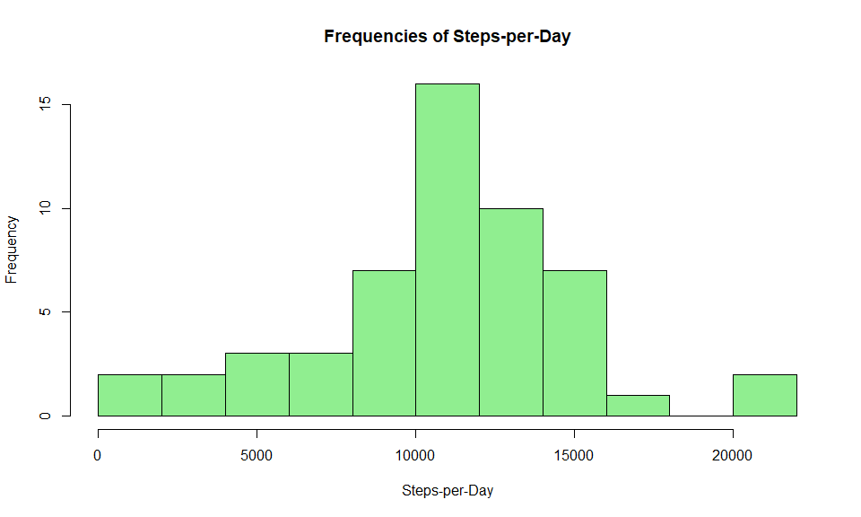

##  Introduction
Quantified-self devices, such as the Fitbit, Nike Fuelband, and Polar A370 Fitness Tracker, are pieces of wearable-technology that record various health-related data about their users. Typical data tracked are heart rate, number of steps taken, and distance ran/walked. Some devices even try to track it's user's sleeping patterns.  

In this report we analyze a dataset recorded by a quantified-self device over a period of 2 months while worn on an anonymous user. In particular, the device recorded the number of steps taken per 5-minute interval.

## Loading and preprocessing the data

Here we load the data into a dataframe, named dat, using R's built-in read.csv method. Also loaded are the dplyr, and ggplot2 packages.  

```r
dat <- read.csv("activity.csv")
library(dplyr)
```

```
## 
## Attaching package: 'dplyr'
```

```
## The following objects are masked from 'package:stats':
## 
##     filter, lag
```

```
## The following objects are masked from 'package:base':
## 
##     intersect, setdiff, setequal, union
```

```r
library(ggplot2)
```

## What is mean total number of steps taken per day?
Below is a histogram of the total number of steps take per and the code that was ran to generate it. 


```r
gdat <- group_by(dat, date)
gdat <- summarise(gdat, stepsperday = sum(steps))
hist(gdat$stepsperday, main = "Frequencies of Steps-per-Day", xlab = "Steps-per-Day", col = "lightgreen", breaks = 10) 
```

<!-- -->
  We can see that on most days the user took more than 10000 steps. Now we calculate the mean and mediam of steps-per-day by running the following code. 


```r
mean(gdat$stepsperday, na.rm = TRUE)
```

```
## [1] 10766.19
```

```r
median(gdat$stepsperday, na.rm = TRUE)
```

```
## [1] 10765
```


## What is the average daily activity pattern?

Calculate the averages of each of these 5-minute intervals accross the 61-day period and make a line plot showing how vary across that period. 


```r
intervalMeans = aggregate(FUN = mean, steps ~ interval, data = dat)
intervalData = as.data.frame(intervalMeans)
names(intervalData) = c("interval_group", "average_steps")

ggplot(intervalData) + geom_line(aes(interval_group, average_steps, col = "red")) +
        xlab("Interval Group") + ylab("Average Steps") +
        labs(title = "Interval Step Averages Over 61-Day Period")  +
        theme_dark()
```

<!-- -->
We determine which 5-minute interval, on average, contains the largest quantity of 
steps.

```r
which(intervalData$average_steps == max(intervalData$average_steps), arr.ind = TRUE)
```

```
## [1] 104
```
On average the user took more steps during the 105th 5-minute interval than any other 5-minute interval.

## Imputing missing values
The number of NA values is computed: 


```r
sum(is.na(dat$steps))
```

```
## [1] 2304
```

```r
sum(is.na(dat$date))
```

```
## [1] 0
```

```r
sum(is.na(dat$interval))
```

```
## [1] 0
```
For each observation, if steps is NA, the NA value is replaced by the mean
value of steps taken for the 5-minutes interval associated with that observation. 


```r
standarddat = data.frame(dat)

for(i in 1:17568)
{
        if(is.na(standarddat$steps[i]))
        {
                inde = i%%288 + 1
                standarddat$steps[i] = intervalData$average_steps[inde]
        }
}

nicedata <- group_by(standarddat, date)
nicedata <- summarise(nicedata, stepsperday = sum(steps))
hist(nicedata$stepsperday, main = "Frequencies of Steps-per-Day", xlab = "Steps-per-Day", col = "lightgreen", breaks  = 10) 
```

<!-- -->

We calculate the mean and medial total number of steps taken each day:

```r
mean(nicedata$stepsperday)
```

```
## [1] 10766.19
```

```r
median(nicedata$stepsperday)
```

```
## [1] 10766.19
```

## Are there differences in activity patterns between weekdays and weekends?

Since the day of the first observation in the dataset is a Monday, if we let i browse over the integers 1-288, then the values of i where i mod 6 = 0 or i mod 7 = 0 correspond to days of the weekend. We use this fact to add a new variable to our dataset, one that tells us if the day
is a weekday or weekend.


```r
standarddat$date = as.character(standarddat$date)
standarddat$date = as.POSIXlt(standarddat$date)
weekdata <- data.frame(standarddat)

for(i in 1:17568)
{
        if( weekdays(standarddat$date[i]) == "Saturday" ||
            weekdays(standarddat$date[i]) == "Sunday")
        {
                   weekdata$day[i] = "weekend"
        }
        else
        {
                weekdata$day[i] = "weekday"
        }
         
}
        

weekdaydat = subset(weekdata, day = "weekday")
weekenddat = subset(weekdata, day = "weekend")

avgweekdaydat = aggregate(FUN = mean, steps ~ interval, data = weekdaydat)
avgweekenddat = aggregate(FUN = mean, steps ~ interval, data = weekenddat)

avgweekdaydat$day = rep("weekday", length(weekdaydat))
avgweekenddat$day = rep("weekend", length(weekenddat))

avgintervaldat = rbind(avgweekenddat, avgweekdaydat)

str(avgintervaldat)
```

```
## 'data.frame':	576 obs. of  3 variables:
##  $ interval: int  0 5 10 15 20 25 30 35 40 45 ...
##  $ steps   : num  1.536 0.312 0.135 0.141 0.34 ...
##  $ day     : chr  "weekend" "weekend" "weekend" "weekend" ...
```

Below, 5-minute interval averages for weekdays and weekends are plotted against the 288 intervals in 2 separate plots.


```r
ggplot(avgintervaldat) + 
        geom_line(aes(x = interval, y = steps, col = day)) +
         facet_grid(day~.) +
        xlab("Interval") + ylab("Steps") +
        labs(title = "Interval Step Averages Over 61-Day Period") +
        scale_y_log10() +
        theme_dark()
```

<!-- -->


