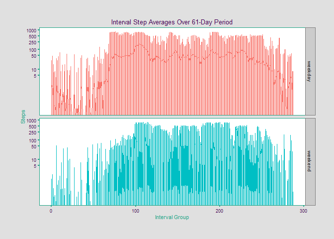

##  Introduction
Quantified-self devices, such as the Fitbit, Nike Fuelband, and Polar A370 Fitness Tracker, are pieces of wearable-technology that record various health-related data about their users. Typical data tracked are heart rate, number of steps taken, and distance ran/walked. Some devices even try to track it's user's sleeping patterns.  

In this report we analyze a dataset recorded by a quantified-self device over a period of 2 months while worn on an anonymous user. In particular, the device recorded the number of steps taken per 5-minute interval.

## Loading and preprocessing the data

Here we load the data into a dataframe, named dat, using R's built-in read.csv method. Also loaded are the dplyr, ggplot2, RColorBrewer, scales, and viridis packages.  

```r
dat <- read.csv("activity.csv")
library(dplyr)
```

```
## 
## Attaching package: 'dplyr'
```

```
## The following objects are masked from 'package:stats':
## 
##     filter, lag
```

```
## The following objects are masked from 'package:base':
## 
##     intersect, setdiff, setequal, union
```

```r
library(ggplot2)
library(viridis)
library(RColorBrewer)
library(scales)
```

## What is mean total number of steps taken per day?
Below is a histogram of the total number of steps take per and the code that was ran to generate it. 


```r
gdat <- group_by(dat, date)
gdat <- summarise(gdat, stepsperday = sum(steps))
hist(gdat$stepsperday, main = "Frequencies of Steps-per-Day", xlab = "Steps-per-Day", col = "lightgreen")
```

<!-- -->
  We can see that on most days the user took more than 10000 steps. Now we calculate the mean and mediam of steps-per-day by running the following code. 


```r
mean(gdat$stepsperday, na.rm = TRUE)
```

```
## [1] 10766.19
```

```r
median(gdat$stepsperday, na.rm = TRUE)
```

```
## [1] 10765
```


## What is the average daily activity pattern?
First we implement a function to define a theme for the plot to come. 

```r
fte_theme <- function() {
  
  # Generate the colors for the chart procedurally with RColorBrewer
  vi_pal = viridis_pal(option = 'D')(30)
  rdg <- brewer.pal("RdGy", n = 11)
  color.plotback = rdg[6]
  color.panelback = rdg[7]
  color.grid.major = rdg[6]
  color.grid.minor = rdg[6]
  color.axis.text = vi_pal[1]
  color.axis.title = vi_pal[18]
  color.title = vi_pal[1]
  color.lines = vi_pal[0]
  color.panelborder = vi_pal[18]
  color.grid.ticks = vi_pal[18]
  
  # Begin construction of chart
  
  theme_bw(base_size=9) +
    
    # Set the entire chart region to a light gray color
    
    theme(panel.background=element_rect(fill=color.plotback, color=color.plotback)) +
    theme(plot.background=element_rect(fill=color.panelback, color=color.panelback)) +
    theme(panel.border=element_rect(color=color.panelborder, size = .5)) +
    
    # Format the grid
    
    theme(panel.grid.major=element_line(color=color.grid.major,size=.25)) +
    theme(panel.grid.minor=element_line(color=color.grid.minor,size=.25)) +
    theme(axis.ticks=element_line(color=color.grid.ticks,size=1)) +

    # Format the legend, but hide by default
    
    theme(legend.position="none") +
    theme(legend.background = element_rect(fill=color.plotback)) +
    theme(legend.text = element_text(size=7,color=color.axis.title)) +
    
    # Set title and axis labels, and format these and tick marks
    
    theme(plot.title=element_text(color=color.title, size=10, vjust=1.25)) +
    theme(axis.text.x=element_text(size=7,color=color.axis.text)) +
    theme(axis.text.y=element_text(size=7,color=color.axis.text)) +
    theme(axis.title.x=element_text(size=8,color=color.axis.title, vjust=0)) +
    theme(axis.title.y=element_text(size=8,color=color.axis.title, vjust=1.25)) +
    
    # Plot margins
    
    theme(plot.margin = unit(c(1, 1, 1, 1), "cm"))
}
```

There are 288 5-minute intervals per day. We add a column 'intervalgroup' to our 
dataframe and initialize it with values from 1-17568. Now, modulo 288, each entry of the intervalgoup column tells us which one of the 288 5-minute intervals it coincides with. We then loop through the 17568 observations and assign an integer between 0-287 according to which 5-minute interval it occurred in. 

```r
dat$intervalgroup = c(1:17568)
for(i in 1:17568)
{
  dat$intervalgroup[i] = dat$intervalgroup[i]%%288
}
```
The next step is to calculate the averages of each of these 5-minute intervals accross the 61-day period and make a line plot showing how vary across that period. 


```r
vi_pal = viridis_pal()(30)
intervalMeans = aggregate(steps ~ intervalgroup, data = dat, mean)
intervalData = as.data.frame(intervalMeans)
names(intervalData) = c("interval_group", "average_steps")

g <- ggplot(intervalData) + geom_line(aes(interval_group, average_steps), col = vi_pal[1]) +
        xlab("Interval Group") + ylab("Average Steps") +
        labs(title = "Interval Group Averages Over 61-Day Period")   + fte_theme()
        
g
```

<!-- -->
We determine which 5-minute interval, on average, contains the largest quantity of 
steps.

```r
which(intervalData$average_steps == max(intervalData$average_steps), arr.ind = TRUE)
```

```
## [1] 105
```
On average the user took more steps during the 105th 5-minute interval than any other 5-minute interval.

## Imputing missing values
The number of NA values is computed: 


```r
sum(is.na(dat$steps))
```

```
## [1] 2304
```

```r
sum(is.na(dat$date))
```

```
## [1] 0
```

```r
sum(is.na(dat$interval))
```

```
## [1] 0
```
For each observation, if steps is NA, the NA value is replaced by the mean
value of steps taken for the 5-minutes interval associated with that observation. 


```r
standarddat = data.frame(dat)
for(i in 1:17568)
{
        if(is.na(standarddat$steps[i]))
        {
                inde = i%%288 + 1
                standarddat$steps[i] = intervalData$average_steps[inde]
        }
}

nicedata <- group_by(standarddat, date)
nicedata <- summarise(nicedata, stepsperday = sum(steps))
hist(nicedata$stepsperday, main = "Frequencies of Steps-per-Day", xlab = "Steps-per-Day", col = "lightgreen")
```

<!-- -->

We calculate the mean and medial total number of steps taken each day:

```r
mean(nicedata$stepsperday)
```

```
## [1] 10766.19
```

```r
median(nicedata$stepsperday)
```

```
## [1] 10766.19
```

## Are there differences in activity patterns between weekdays and weekends?

Since the day of the first observation in the dataset is a Monday, and since there are
61 days of observations in the dataset, if we let i browse over the integers 1-61, then
the values of i where i mod 6 = 0 or i mod 7 = 0 correspond to days of the weekend.
We use this fact to add a new variable to our dataset, one that tells us if the day
is a weekday or weekend.


```r
day = 0
standarddat$day = rep("day", 17568)
for(i in 1:61)
{
        if(i%%6==0 || i%%7==0)
        {
                for(k in 1:288)
                {
                        standarddat$day[day*288 + k] = "weekend"
                }
                day = day + 1
        }
        else
        {
                for(k in 1:288)
                {
                        standarddat$day[day*288 + k] = "weekday"
                }
                day = day + 1
        }

}
standarddat$day = as.factor(standarddat$day)
str(standarddat)
```

```
## 'data.frame':	17568 obs. of  5 variables:
##  $ steps        : num  1.717 0.3396 0.1321 0.1509 0.0755 ...
##  $ date         : Factor w/ 61 levels "2012-10-01","2012-10-02",..: 1 1 1 1 1 1 1 1 1 1 ...
##  $ interval     : int  0 5 10 15 20 25 30 35 40 45 ...
##  $ intervalgroup: num  1 2 3 4 5 6 7 8 9 10 ...
##  $ day          : Factor w/ 2 levels "weekday","weekend": 1 1 1 1 1 1 1 1 1 1 ...
```

Below, 5-minute interval averages for weekdays and weekends are plotted against the 288 intervals in 2 separate plots.


```r
ggplot(standarddat) + 
        geom_line(aes(intervalgroup, steps, col = day)) +
        xlab("Interval Group") + ylab("Steps") +
        labs(title = "Interval Group Steps Over 61-Day Period") +
        scale_y_log10(breaks = c(0,5,10,50,100,250,500,1000)) +
        facet_grid(day~.)
```

<!-- -->

```r
        fte_theme()
```

```
## List of 44
##  $ line                 :List of 4
##   ..$ colour  : chr "black"
##   ..$ size    : num 0.5
##   ..$ linetype: num 1
##   ..$ lineend : chr "butt"
##   ..- attr(*, "class")= chr [1:2] "element_line" "element"
##  $ rect                 :List of 4
##   ..$ fill    : chr "white"
##   ..$ colour  : chr "black"
##   ..$ size    : num 0.5
##   ..$ linetype: num 1
##   ..- attr(*, "class")= chr [1:2] "element_rect" "element"
##  $ text                 :List of 10
##   ..$ family    : chr ""
##   ..$ face      : chr "plain"
##   ..$ colour    : chr "black"
##   ..$ size      : num 9
##   ..$ hjust     : num 0.5
##   ..$ vjust     : num 0.5
##   ..$ angle     : num 0
##   ..$ lineheight: num 0.9
##   ..$ margin    :Classes 'margin', 'unit'  atomic [1:4] 0 0 0 0
##   .. .. ..- attr(*, "valid.unit")= int 8
##   .. .. ..- attr(*, "unit")= chr "pt"
##   ..$ debug     : logi FALSE
##   ..- attr(*, "class")= chr [1:2] "element_text" "element"
##  $ axis.line            :List of 4
##   ..$ colour  : NULL
##   ..$ size    : NULL
##   ..$ linetype: NULL
##   ..$ lineend : NULL
##   ..- attr(*, "class")= chr [1:2] "element_line" "element"
##  $ axis.line.x          : list()
##   ..- attr(*, "class")= chr [1:2] "element_blank" "element"
##  $ axis.line.y          : list()
##   ..- attr(*, "class")= chr [1:2] "element_blank" "element"
##  $ axis.text            :List of 10
##   ..$ family    : NULL
##   ..$ face      : NULL
##   ..$ colour    : NULL
##   ..$ size      :Class 'rel'  num 0.8
##   ..$ hjust     : NULL
##   ..$ vjust     : NULL
##   ..$ angle     : NULL
##   ..$ lineheight: NULL
##   ..$ margin    : NULL
##   ..$ debug     : NULL
##   ..- attr(*, "class")= chr [1:2] "element_text" "element"
##  $ axis.text.x          :List of 10
##   ..$ family    : NULL
##   ..$ face      : NULL
##   ..$ colour    : chr "#440154FF"
##   ..$ size      : num 7
##   ..$ hjust     : NULL
##   ..$ vjust     : num 1
##   ..$ angle     : NULL
##   ..$ lineheight: NULL
##   ..$ margin    :Classes 'margin', 'unit'  atomic [1:4] 1.8 0 0 0
##   .. .. ..- attr(*, "valid.unit")= int 8
##   .. .. ..- attr(*, "unit")= chr "pt"
##   ..$ debug     : NULL
##   ..- attr(*, "class")= chr [1:2] "element_text" "element"
##  $ axis.text.y          :List of 10
##   ..$ family    : NULL
##   ..$ face      : NULL
##   ..$ colour    : chr "#440154FF"
##   ..$ size      : num 7
##   ..$ hjust     : num 1
##   ..$ vjust     : NULL
##   ..$ angle     : NULL
##   ..$ lineheight: NULL
##   ..$ margin    :Classes 'margin', 'unit'  atomic [1:4] 0 1.8 0 0
##   .. .. ..- attr(*, "valid.unit")= int 8
##   .. .. ..- attr(*, "unit")= chr "pt"
##   ..$ debug     : NULL
##   ..- attr(*, "class")= chr [1:2] "element_text" "element"
##  $ axis.ticks           :List of 4
##   ..$ colour  : chr "#20A486FF"
##   ..$ size    : num 1
##   ..$ linetype: NULL
##   ..$ lineend : NULL
##   ..- attr(*, "class")= chr [1:2] "element_line" "element"
##  $ axis.ticks.length    :Class 'unit'  atomic [1:1] 2.25
##   .. ..- attr(*, "valid.unit")= int 8
##   .. ..- attr(*, "unit")= chr "pt"
##  $ axis.title.x         :List of 10
##   ..$ family    : NULL
##   ..$ face      : NULL
##   ..$ colour    : chr "#20A486FF"
##   ..$ size      : num 8
##   ..$ hjust     : NULL
##   ..$ vjust     : num 0
##   ..$ angle     : NULL
##   ..$ lineheight: NULL
##   ..$ margin    :Classes 'margin', 'unit'  atomic [1:4] 3.6 0 1.8 0
##   .. .. ..- attr(*, "valid.unit")= int 8
##   .. .. ..- attr(*, "unit")= chr "pt"
##   ..$ debug     : NULL
##   ..- attr(*, "class")= chr [1:2] "element_text" "element"
##  $ axis.title.y         :List of 10
##   ..$ family    : NULL
##   ..$ face      : NULL
##   ..$ colour    : chr "#20A486FF"
##   ..$ size      : num 8
##   ..$ hjust     : NULL
##   ..$ vjust     : num 1.25
##   ..$ angle     : num 90
##   ..$ lineheight: NULL
##   ..$ margin    :Classes 'margin', 'unit'  atomic [1:4] 0 3.6 0 1.8
##   .. .. ..- attr(*, "valid.unit")= int 8
##   .. .. ..- attr(*, "unit")= chr "pt"
##   ..$ debug     : NULL
##   ..- attr(*, "class")= chr [1:2] "element_text" "element"
##  $ legend.background    :List of 4
##   ..$ fill    : chr "#FFFFFF"
##   ..$ colour  : logi NA
##   ..$ size    : NULL
##   ..$ linetype: NULL
##   ..- attr(*, "class")= chr [1:2] "element_rect" "element"
##  $ legend.margin        :Class 'unit'  atomic [1:1] 0.2
##   .. ..- attr(*, "valid.unit")= int 1
##   .. ..- attr(*, "unit")= chr "cm"
##  $ legend.key           :List of 4
##   ..$ fill    : NULL
##   ..$ colour  : chr "grey80"
##   ..$ size    : NULL
##   ..$ linetype: NULL
##   ..- attr(*, "class")= chr [1:2] "element_rect" "element"
##  $ legend.key.size      :Class 'unit'  atomic [1:1] 1.2
##   .. ..- attr(*, "valid.unit")= int 3
##   .. ..- attr(*, "unit")= chr "lines"
##  $ legend.key.height    : NULL
##  $ legend.key.width     : NULL
##  $ legend.text          :List of 10
##   ..$ family    : NULL
##   ..$ face      : NULL
##   ..$ colour    : chr "#20A486FF"
##   ..$ size      : num 7
##   ..$ hjust     : NULL
##   ..$ vjust     : NULL
##   ..$ angle     : NULL
##   ..$ lineheight: NULL
##   ..$ margin    : NULL
##   ..$ debug     : NULL
##   ..- attr(*, "class")= chr [1:2] "element_text" "element"
##  $ legend.text.align    : NULL
##  $ legend.title         :List of 10
##   ..$ family    : NULL
##   ..$ face      : NULL
##   ..$ colour    : NULL
##   ..$ size      : NULL
##   ..$ hjust     : num 0
##   ..$ vjust     : NULL
##   ..$ angle     : NULL
##   ..$ lineheight: NULL
##   ..$ margin    : NULL
##   ..$ debug     : NULL
##   ..- attr(*, "class")= chr [1:2] "element_text" "element"
##  $ legend.title.align   : NULL
##  $ legend.position      : chr "none"
##  $ legend.direction     : NULL
##  $ legend.justification : chr "center"
##  $ legend.box           : NULL
##  $ panel.background     :List of 4
##   ..$ fill    : chr "#FFFFFF"
##   ..$ colour  : chr "#FFFFFF"
##   ..$ size    : NULL
##   ..$ linetype: NULL
##   ..- attr(*, "class")= chr [1:2] "element_rect" "element"
##  $ panel.border         :List of 4
##   ..$ fill    : logi NA
##   ..$ colour  : chr "#20A486FF"
##   ..$ size    : num 0.5
##   ..$ linetype: NULL
##   ..- attr(*, "class")= chr [1:2] "element_rect" "element"
##  $ panel.grid.major     :List of 4
##   ..$ colour  : chr "#FFFFFF"
##   ..$ size    : num 0.25
##   ..$ linetype: NULL
##   ..$ lineend : NULL
##   ..- attr(*, "class")= chr [1:2] "element_line" "element"
##  $ panel.grid.minor     :List of 4
##   ..$ colour  : chr "#FFFFFF"
##   ..$ size    : num 0.25
##   ..$ linetype: NULL
##   ..$ lineend : NULL
##   ..- attr(*, "class")= chr [1:2] "element_line" "element"
##  $ panel.margin         :Class 'unit'  atomic [1:1] 4.5
##   .. ..- attr(*, "valid.unit")= int 8
##   .. ..- attr(*, "unit")= chr "pt"
##  $ panel.margin.x       : NULL
##  $ panel.margin.y       : NULL
##  $ panel.ontop          : logi FALSE
##  $ strip.background     :List of 4
##   ..$ fill    : chr "grey80"
##   ..$ colour  : chr "grey50"
##   ..$ size    : num 0.2
##   ..$ linetype: NULL
##   ..- attr(*, "class")= chr [1:2] "element_rect" "element"
##  $ strip.text           :List of 10
##   ..$ family    : NULL
##   ..$ face      : NULL
##   ..$ colour    : chr "grey10"
##   ..$ size      :Class 'rel'  num 0.8
##   ..$ hjust     : NULL
##   ..$ vjust     : NULL
##   ..$ angle     : NULL
##   ..$ lineheight: NULL
##   ..$ margin    : NULL
##   ..$ debug     : NULL
##   ..- attr(*, "class")= chr [1:2] "element_text" "element"
##  $ strip.text.x         :List of 10
##   ..$ family    : NULL
##   ..$ face      : NULL
##   ..$ colour    : NULL
##   ..$ size      : NULL
##   ..$ hjust     : NULL
##   ..$ vjust     : NULL
##   ..$ angle     : NULL
##   ..$ lineheight: NULL
##   ..$ margin    :Classes 'margin', 'unit'  atomic [1:4] 4.5 0 4.5 0
##   .. .. ..- attr(*, "valid.unit")= int 8
##   .. .. ..- attr(*, "unit")= chr "pt"
##   ..$ debug     : NULL
##   ..- attr(*, "class")= chr [1:2] "element_text" "element"
##  $ strip.text.y         :List of 10
##   ..$ family    : NULL
##   ..$ face      : NULL
##   ..$ colour    : NULL
##   ..$ size      : NULL
##   ..$ hjust     : NULL
##   ..$ vjust     : NULL
##   ..$ angle     : num -90
##   ..$ lineheight: NULL
##   ..$ margin    :Classes 'margin', 'unit'  atomic [1:4] 0 4.5 0 4.5
##   .. .. ..- attr(*, "valid.unit")= int 8
##   .. .. ..- attr(*, "unit")= chr "pt"
##   ..$ debug     : NULL
##   ..- attr(*, "class")= chr [1:2] "element_text" "element"
##  $ strip.switch.pad.grid:Class 'unit'  atomic [1:1] 0.1
##   .. ..- attr(*, "valid.unit")= int 1
##   .. ..- attr(*, "unit")= chr "cm"
##  $ strip.switch.pad.wrap:Class 'unit'  atomic [1:1] 0.1
##   .. ..- attr(*, "valid.unit")= int 1
##   .. ..- attr(*, "unit")= chr "cm"
##  $ plot.background      :List of 4
##   ..$ fill    : chr "#E0E0E0"
##   ..$ colour  : chr "#E0E0E0"
##   ..$ size    : NULL
##   ..$ linetype: NULL
##   ..- attr(*, "class")= chr [1:2] "element_rect" "element"
##  $ plot.title           :List of 10
##   ..$ family    : NULL
##   ..$ face      : NULL
##   ..$ colour    : chr "#440154FF"
##   ..$ size      : num 10
##   ..$ hjust     : NULL
##   ..$ vjust     : num 1.25
##   ..$ angle     : NULL
##   ..$ lineheight: NULL
##   ..$ margin    :Classes 'margin', 'unit'  atomic [1:4] 0 0 5.4 0
##   .. .. ..- attr(*, "valid.unit")= int 8
##   .. .. ..- attr(*, "unit")= chr "pt"
##   ..$ debug     : NULL
##   ..- attr(*, "class")= chr [1:2] "element_text" "element"
##  $ plot.margin          :Class 'unit'  atomic [1:4] 1 1 1 1
##   .. ..- attr(*, "valid.unit")= int 1
##   .. ..- attr(*, "unit")= chr "cm"
##  - attr(*, "class")= chr [1:2] "theme" "gg"
##  - attr(*, "complete")= logi TRUE
##  - attr(*, "validate")= logi TRUE
```


